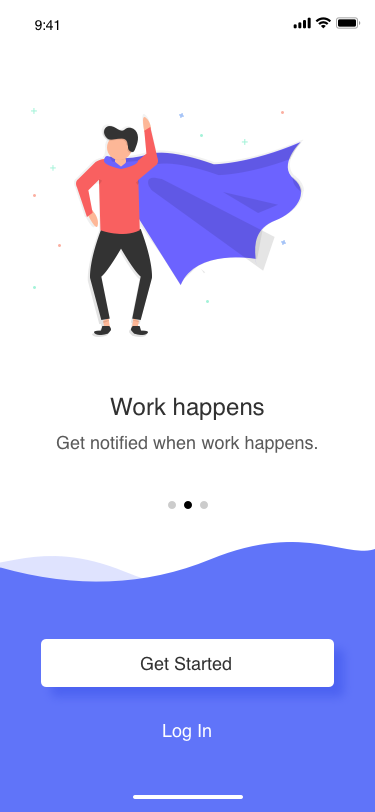
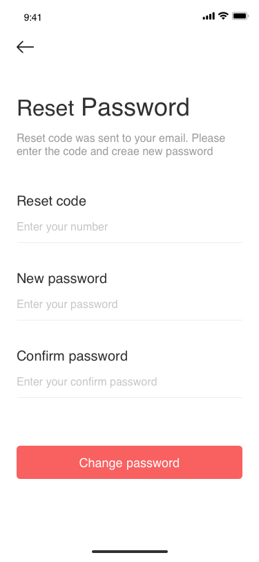
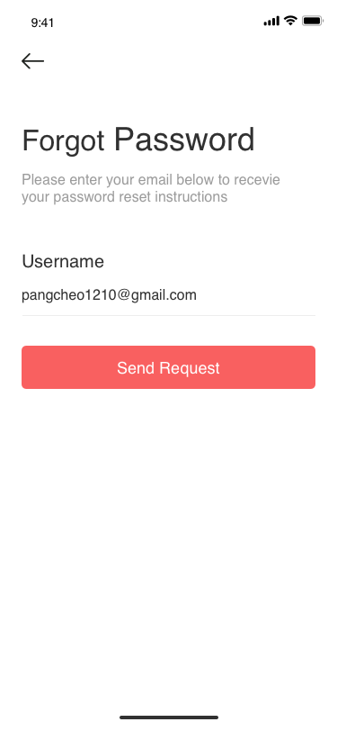
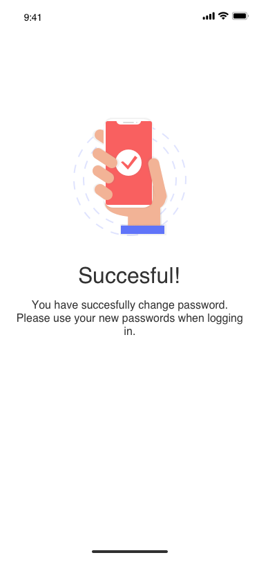

# Form
Pada praktikum kali ini akan dibuat beberapa activity, yaitu:

1. Acitivity WelcomeBack
2. Activity WelcomeSlideSuperHero
3. Activity WelcomeSlideAssign
4. Activity ResetPassword
5. Activity ForgotPassword
6. Activity Success

## Membuat Activity WelcomeBack
Buatlah activity baru dengan nama WelcomeBack. Halaman ini akan digunakan sebagai form login. Untuk membuatnya activity tersebut adalah Klik Kanan di package **dtschapter03_starter->new->activity->empty activity**

Langkah selanjutnya adalah melakukan desain layout pada file `activity_welcome_back.xml`. Berikut ini merupakan screenshot tampilan aplikasi yang diharapkan.


### Edit activity_welcome_back.xml
Untuk membuat form login seperti gambar diatas, Anda perlu mengubah isi dari file `activity_welcome_back.xml`. Constraint layout digunakan pada layout `activity_welcome_back.xml`. Pastikan layout xml dimulai dengan tag berikut ini. Tambahkan background warna putih.

```xml
<android.support.constraint.ConstraintLayout xmlns:android="http://schemas.android.com/apk/res/android"
    xmlns:app="http://schemas.android.com/apk/res-auto"
    xmlns:tools="http://schemas.android.com/tools"
    android:layout_width="match_parent"
    android:layout_height="match_parent"
    android:background="#FFFFFF"
    tools:context=".WelcomeBack">

</android.support.constraint.ConstraintLayout>
```

Pada desain layout terdapat beberapa komponen yaitu:
1. Judul
2. Sub Judul
3. Username
4. Edit Text Username
5. Password
6. Edit Text Password
7. Text Forgot Password
8. Button Login

#### Tambahkan Judul
Tambahkan sebuah `TextView` untuk menulis judul.

```xml
<TextView
        android:id="@+id/welcome_back"
        android:layout_width="wrap_content"
        android:layout_height="wrap_content"
        android:layout_marginLeft="24dp"
        android:fontFamily="@font/montserrat_semi_bold"
        android:text="Welcome Back"
        android:textColor="#313131"
        android:textSize="32sp"
        app:layout_constraintLeft_toLeftOf="parent"
        app:layout_constraintTop_toTopOf="parent"
        android:layout_marginTop="90dp"
        />
```

#### Tambahkan Sub Judul
Tambahkan sebuah sub text baru di bawah judul dengan id `sign_in` dengan menggunakan `TextView`

```xml
<TextView
        android:id="@+id/sign_in"
        android:layout_width="wrap_content"
        android:layout_height="wrap_content"
        android:layout_marginLeft="24dp"
        android:layout_marginTop="8dp"
        android:fontFamily="@font/montserrat_light"
        android:text="@string/sign_in_to_continue"
        android:textColor="#9b9b9b"
        android:textSize="16sp"
        app:layout_constraintLeft_toLeftOf="parent"
        app:layout_constraintTop_toBottomOf="@id/welcome_back" />
```

#### Tambahkan Username
Tambahkan `TextView` sebagai label Username

```xml
<TextView
        android:id="@+id/reset_code"
        android:layout_width="wrap_content"
        android:layout_height="wrap_content"
        android:layout_marginLeft="20dp"
        android:layout_marginTop="48dp"
        android:text="Username"
        android:textColor="#313131"
        android:textSize="20sp"
        app:layout_constraintLeft_toLeftOf="parent"
        app:layout_constraintTop_toBottomOf="@+id/sign_in" />
```

#### Tambahkan EditText Username
Tambahkan `EditText` untuk pengisian Username

[//]: # (TODO : fix id edt_reset_code)

```xml
<EditText
        android:id="@+id/edt_reset_code"
        android:layout_width="match_parent"
        android:layout_height="wrap_content"
        android:layout_marginLeft="24dp"
        android:layout_marginTop="8dp"
        android:layout_marginRight="24dp"
        android:hint="Enter Your Email"
        app:layout_constraintLeft_toLeftOf="parent"
        app:layout_constraintRight_toRightOf="parent"
        app:layout_constraintTop_toBottomOf="@id/reset_code"
        />
```

#### Tambahkan Password
Tambahkan label Password menggunakan `TextView`

[//]: # (TODO : fix id edt_reset_code)

```xml
<TextView
        android:id="@+id/new_password"
        android:layout_width="wrap_content"
        android:layout_height="wrap_content"
        android:layout_marginLeft="20dp"
        android:layout_marginTop="8dp"
        android:text="Password"
        android:textColor="#313131"
        android:textSize="20sp"
        app:layout_constraintLeft_toLeftOf="parent"
        app:layout_constraintTop_toBottomOf="@+id/edt_reset_code" />
```

#### Tambahkan EditText Password
Tambahkan `EditText` untuk pengisian password.

```xml
<EditText
        android:id="@+id/edt_new_password"
        android:layout_width="match_parent"
        android:layout_height="wrap_content"
        android:layout_marginLeft="24dp"
        android:layout_marginTop="8dp"
        android:layout_marginRight="24dp"
        android:hint="@string/enter_your_password"
        app:layout_constraintLeft_toLeftOf="parent"
        app:layout_constraintRight_toRightOf="parent"
        app:layout_constraintTop_toBottomOf="@+id/new_password" />
```

#### Tambahkan Text Forgot Password
Tambahkan teks **Forgot Password** yang dapat di-klik sebagai button bagi pengguna yang lupa password.

```xml
<TextView
        android:id="@+id/forgot_password"
        android:layout_width="wrap_content"
        android:layout_height="wrap_content"
        android:layout_marginTop="8dp"
        android:layout_marginRight="24dp"
        android:text="@string/forgot_password"
        android:textColor="#313131"
        android:textSize="18sp"
        app:layout_constraintRight_toRightOf="parent"
        app:layout_constraintTop_toBottomOf="@id/edt_new_password"
        />
```

#### Buat Drawable button_red.xml
Tambahkan sebuah file pada package **res->drawable** dengan nama `button_red.xml`. Ganti isi file `button_red.xml` dengan kode berikut, 

```xml
<?xml version="1.0" encoding="utf-8"?>
<shape xmlns:android="http://schemas.android.com/apk/res/android"
    android:shape="rectangle">
    <solid android:color="#F96060" />
    <corners android:radius="5dp" />
</shape>
```

#### Tambahkan Button Login
Buat button untuk fungsi Log In. Pada button tersebut, ganti teks button menjadi  **LOG IN**. Beri warna putih pada teks **LOG IN**.

```xml
<Button
        android:layout_width="match_parent"
        android:layout_height="wrap_content"
        android:layout_marginStart="24dp"
        android:layout_marginEnd="24dp"
        android:textSize="18sp"
        android:layout_marginBottom="200dp"
        android:background="@drawable/button_red"
        android:text="LOG IN"
        android:textColor="#FFFFFF"
        app:layout_constraintTop_toBottomOf="@id/forgot_password"
        android:layout_marginTop="80dp"
        app:layout_constraintEnd_toEndOf="parent"
        app:layout_constraintStart_toStartOf="parent"
        />
```

## Membuat Activity WelcomeSlideSuperHero
Buatlah activity baru dengan nama **WelcomeSlideSuperhero**. Activity ini nantinya akan muncul sebagai aksi button "**Get Started**" yang terdapat pada activity WelcomeSlide. Untuk membuatnya,klik kanan pada package **dtschapter03_starter->New->Activity->Empty Activity**.
Langkah selanjutnya adalah melakukan desain layout pada file `activity_welcome_slide_superhero.xml`. Berikut ini screenshot tampilan aplikasi yang diharapkan.




### Edit layout activity_welcome_slide_superhero.xml
Untuk membuat layout seperti gambar diatas,  ubah isi file `activity_welcome_slide_superhero`. Pada layout ini digunakan constraint layout. Pastikan layout xml dimulai dengan tag berikut ini. Tambahkan background warna putih.

```xml
<?xml version="1.0" encoding="utf-8"?>
<android.support.constraint.ConstraintLayout xmlns:android="http://schemas.android.com/apk/res/android"
    xmlns:app="http://schemas.android.com/apk/res-auto"
    xmlns:tools="http://schemas.android.com/tools"
    android:layout_width="match_parent"
    android:background="#FFFFFF"
    android:layout_height="match_parent"
    tools:context=".WelcomeSlideSuperhero">

</android.support.constraint.ConstraintLayout>
```

Pada desain layout ini terdapat beberapa komponen yaitu:
1. Image Icon
2. Judul Image
3. Sub judul image
4. Image Background
5. Button get started
6. Text Login


#### Tambahkan ImageView
Tambahkan sebuah `ImageView` untuk menambahkan gambar. Berikan `id` dengan nama `slide_dua`. Panggil file gambar **ic_superhero** dari package **drawable**.
```xml
<ImageView
        android:id="@+id/slide_dua"
        android:layout_width="wrap_content"
        android:layout_height="wrap_content"
        android:layout_marginStart="8dp"
        android:layout_marginEnd="8dp"
        app:layout_constraintTop_toTopOf="parent"
        android:layout_marginTop="30dp"
        android:src="@drawable/ic_superhero"
        app:layout_constraintEnd_toEndOf="parent"
        app:layout_constraintStart_toStartOf="parent" />
```

#### Tambahkan Judul Image
Tambahkan sebuah `TextView` untuk menulis judul dengan id `welcome_text`

```xml
<TextView
        android:id="@+id/welcome_text"
        android:layout_width="wrap_content"
        android:layout_height="wrap_content"
        app:layout_constraintTop_toBottomOf="@+id/slide_dua"
        app:layout_constraintLeft_toLeftOf="parent"
        app:layout_constraintRight_toRightOf="parent"
        android:text="Work Happen"
        android:textColor="#313131"
        android:textSize="24sp"
        android:fontFamily="@font/montserrat_semi_bold"
        />
```

#### Tambahkan Sub Judul Image
Tambahkan sebuah sub text baru di bawah judul dengan menggunakan `TextView`. Gunakan id `sub_welcome` sebagai id `TextView`.

```xml
<TextView
        android:id="@+id/sub_welcome"
        android:layout_width="wrap_content"
        android:layout_height="wrap_content"
        app:layout_constraintTop_toBottomOf="@id/welcome_text"
        app:layout_constraintLeft_toLeftOf="parent"
        app:layout_constraintRight_toRightOf="parent"
        android:text="Get Notified When Work Happens"
        android:fontFamily="@font/montserrat_light"
        android:textColor="#313131"
        />
```

#### Tambahkan Image Backgroud
Tambahkan sebuah `ImageView` untuk menambahkan gambar. Gunakan id dengna nama `backgorud_dua`. Gunakan file gambar **bg_blue** dari drawable.
```xml
 <ImageView
        android:id="@+id/background_dua"
        android:layout_width="match_parent"
        android:layout_height="wrap_content"
        android:scaleType="fitXY"
        android:src="@drawable/bg_blue"
        app:layout_constraintBottom_toBottomOf="parent"
        app:layout_constraintLeft_toLeftOf="parent"
        app:layout_constraintLeft_toRightOf="parent"
        />
```

#### Buat Drawable button_white.xml
Tambahkan sebuah file pada package **res->drawable** dengan nama `button_white.xml`. Ganti isi file `button_white.xml` dengan kode dibawah ini,

[//]: # (TODO : Editing baru sampai sini)

```xml
<?xml version="1.0" encoding="utf-8"?>
<shape xmlns:android="http://schemas.android.com/apk/res/android"
    android:shape="rectangle">
    <solid android:color="#FFFFFF" />
    <corners android:radius="5dp" />
    <!--<stroke android:width="1dp"-->
        <!--android:color="#979797" />-->
</shape>
```

#### Tambahkan Button get started
Buat Button get started, beri text `GET STARTED` dengan nama id=btn_get_started
```xml

<Button
        android:id="@+id/btn_get_started"
        android:layout_width="match_parent"
        android:layout_height="wrap_content"
        app:layout_constraintBottom_toTopOf="@id/login_text"
        app:layout_constraintLeft_toLeftOf="parent"
        app:layout_constraintRight_toRightOf="parent"
        android:layout_marginLeft="42dp"
        android:layout_marginRight="42dp"
        android:textSize="18sp"
        android:text="@string/get_started"
        android:fontFamily="@font/montserrat_light"
        android:background="@drawable/button_white"
        android:layout_marginBottom="42dp"

        />
```
#### Tambahkan Text Login
Tambahkan text Login yang nantinya dapat di klik untuk menuju form login, kemudian berilah nama id=login_text.
```xml
<TextView
        android:id="@+id/login_text"
        android:layout_width="wrap_content"
        android:layout_height="wrap_content"
        app:layout_constraintBottom_toBottomOf="parent"
        app:layout_constraintLeft_toLeftOf="parent"
        app:layout_constraintRight_toRightOf="parent"
        android:text="@string/log_in"
        android:fontFamily="@font/montserrat_light"
        android:textSize="18sp"
        android:textColor="#FFFFFF"
        android:layout_marginBottom="72dp"
        />
```

## Membuat Activity WelcomeSlideAssign
Buatlah activity baru dengan nama WelcomeSlideAssign. Halaman ini akan digunakan sebagai form Task and Assign. Untuk membuatnya activity tersebut adalah Klik Kanan di package dtschapter03_starter->new->activity->empty activity.
Langkah selanjutnya adalah melakukan desain layout pada file `activity_slide_assign.xml`, Berikut ini screen shot tampilan aplikasi yang diharapkan.


### Edit activity_slide_assign.xml
Untuk membuat form  seperti gambar diatas yaitu dengan mengubah isi file dari `activity_slide_assign.xml`, pada layout ini akan digunakan constraint layout pastikan layout xml dimulai dengan tag berikut ini. Tambahkan background warna putih.

```xml
<?xml version="1.0" encoding="utf-8"?>
<android.support.constraint.ConstraintLayout xmlns:android="http://schemas.android.com/apk/res/android"
    xmlns:app="http://schemas.android.com/apk/res-auto"
    xmlns:tools="http://schemas.android.com/tools"
    android:layout_width="match_parent"
    android:layout_height="match_parent"
    android:background="#FFFFFF"
    tools:context=".WelcomeSlideAssign">
</android.support.constraint.ConstraintLayout>
```
Pada desain layout ini terdapat beberapa komponen yaitu:
1. Image Icon
2. Judul Image
3. Sub judul image
4. Image Background
5. Button get started
6. Text Login

#### Tambahkan Image Icon
Tambahkan sebuah ImageView untuk menambahkan gambar dengan nama id= slide_tiga, serta tambahkan file gambar ic_assign di drawable.
```xml
<ImageView
        android:id="@+id/slide_tiga"
        app:layout_constraintTop_toTopOf="parent"
        app:layout_constraintLeft_toLeftOf="parent"
        app:layout_constraintRight_toRightOf="parent"
        android:layout_marginTop="30dp"
        android:layout_width="match_parent"
        android:layout_height="wrap_content"
        android:src="@drawable/ic_assign"
        />
```

#### Tambahkan Judul Image
Tambahkan sebuah TextView untuk menulis judul dengan nama id=welcome_text
```xml
<TextView
        android:id="@+id/welcome_text"
        android:layout_width="wrap_content"
        android:layout_height="wrap_content"
        app:layout_constraintLeft_toLeftOf="parent"
        app:layout_constraintRight_toRightOf="parent"
        app:layout_constraintTop_toBottomOf="@+id/slide_tiga"
        android:text="Task and Assign"
        android:fontFamily="@font/montserrat_semi_bold"
        android:textSize="24sp"
        android:textColor="#313131"
        />
```

#### Tambahkan Sub Judul Image
Tambahkan sebuah sub text baru di bawah judul
```xml
 <TextView
        android:layout_width="wrap_content"
        android:layout_height="wrap_content"
        app:layout_constraintLeft_toLeftOf="parent"
        app:layout_constraintRight_toRightOf="parent"
        android:textColor="#313131"
        app:layout_constraintTop_toBottomOf="@+id/welcome_text"
        android:text="Task and Assign them to colleagues"
        android:fontFamily="@font/montserrat_light"
        />
```

#### Tambahkan Image Background
Tambahkan sebuah ImageView untuk menambahkan gambar dengan nama id= background_tiga, serta tambahkan file gambar bg_purple di drawable.
```xml
 <ImageView
        android:id="@+id/background_tiga"
        android:layout_width="match_parent"
        android:layout_height="wrap_content"
        android:scaleType="fitXY"
        android:src="@drawable/bg_purple"
        app:layout_constraintRight_toRightOf="parent"
        app:layout_constraintLeft_toLeftOf="parent"
        app:layout_constraintBottom_toBottomOf="parent"
        />
```

#### Tambahkan Button get started
Buat Button get started, beri text `GET STARTED` dengan nama id=btn_get_started
```xml
<Button
 <Button
        android:id="@+id/btn_get_started"
        android:layout_width="match_parent"
        android:layout_height="wrap_content"
        app:layout_constraintBottom_toTopOf="@+id/login_text"
        app:layout_constraintLeft_toLeftOf="parent"
        app:layout_constraintRight_toRightOf="parent"
        android:layout_marginLeft="42dp"
        android:layout_marginRight="42dp"
        android:text="Get Started"
        android:background="@drawable/button_white"
        android:layout_marginBottom="32dp"
        android:textSize="18sp"
        android:fontFamily="@font/montserrat_light"
        />
```
#### Tambahkan Text Login
Tambahkan text Login yang nantinya dapat di klik untuk menuju form login, kemudian berilah nama id=login_text.
```xml
<TextView
        android:id="@+id/login_text"
        android:layout_width="wrap_content"
        android:layout_height="wrap_content"
        android:text="Log In"
        android:textColor="#FFFFFF"
        app:layout_constraintBottom_toBottomOf="parent"
        app:layout_constraintLeft_toLeftOf="parent"
        app:layout_constraintRight_toRightOf="parent"
        android:textSize="18sp"
        android:fontFamily="@font/montserrat_light"
        android:layout_marginBottom="72dp"
        />
```
## Membuat Activity Reset Password
Buatlah activity baru dengan nama ResetPassword. Halaman ini akan digunakan sebagai form untuk melakukan reset password. Untuk membuatnya activity tersebut adalah Klik Kanan di package dtschapter03_starter->new->activity->empty activity.
Langkah selanjutnya adalah melakukan desain layout pada file `activity_reset_password.xml`, Berikut ini screen shot tampilan aplikasi yang diharapkan.


### Edit activity_reset_password.xml
Untuk membuat form reset password seperti gambar diatas yaitu dengan mengubah isi file dari `activity_reset_password.xml`, pada layout ini akan digunakan constraint layout pastikan layout xml dimulai dengan tag berikut ini.

```xml
<?xml version="1.0" encoding="utf-8"?>
<android.support.constraint.ConstraintLayout xmlns:android="http://schemas.android.com/apk/res/android"
    xmlns:app="http://schemas.android.com/apk/res-auto"
    xmlns:tools="http://schemas.android.com/tools"
    android:layout_width="match_parent"
    android:layout_height="match_parent"
    tools:context=".ResetPassword">
</android.support.constraint.ConstraintLayout>
```
Pada desain layout terdapat beberapa komponen yaitu:
1. Judul
2. Sub Judul
3. Reset Code
4. Edit Reset Code
5. New Password
6. Edit Text New Password
7. Confirm Password
8. Edit Confirm Password
9. Button Change Password

#### Tambahkan Judul
Tambahkan sebuah TextView untuk menulis judul
```xml
<TextView
        android:id="@+id/welcome_back"
        android:layout_width="wrap_content"
        android:layout_height="wrap_content"
        android:layout_marginLeft="24dp"
        android:fontFamily="@font/montserrat_semi_bold"
        android:text="Reset Password"
        android:textColor="#313131"
        android:textSize="32sp"
        app:layout_constraintLeft_toLeftOf="parent"
        app:layout_constraintTop_toTopOf="parent"
        android:layout_marginTop="90dp"
        />
```

#### Sub Judul
Tambahkan sebuah sub judul baru di bawah judul untuk memberikan keterangan judul
```xml
<TextView
        android:id="@+id/sign_in"
        android:layout_width="wrap_content"
        android:layout_height="wrap_content"
        android:layout_marginLeft="24dp"
        android:layout_marginTop="8dp"
        android:fontFamily="@font/montserrat_light"
        android:text="Reset code was sent to your email. Please enter the code and create new password."
        android:textColor="#9b9b9b"
        android:textSize="16sp"
        app:layout_constraintLeft_toLeftOf="parent"
        app:layout_constraintTop_toBottomOf="@id/welcome_back" />
```

#### Tambahkan Reset Code
Tambahkan Text View untuk label reset code.
```xml
<TextView
        android:id="@+id/reset_code"
        android:layout_width="wrap_content"
        android:layout_height="wrap_content"
        android:layout_marginLeft="20dp"
        android:layout_marginTop="48dp"
        android:text="@string/reset_code"
        android:textColor="#313131"
        android:textSize="20sp"
        app:layout_constraintLeft_toLeftOf="parent"
        app:layout_constraintTop_toBottomOf="@+id/sign_in" />
```

#### Tambahkan Edit Text Reset Code
Tambahkan Edit Text untuk pengisian Reset Code
```xml
 <EditText
        android:id="@+id/edt_reset_code"
        android:layout_width="match_parent"
        android:layout_height="wrap_content"
        android:layout_marginLeft="24dp"
        android:layout_marginTop="8dp"
        android:layout_marginRight="24dp"
        android:hint="@string/enter_your_reset_code"
        app:layout_constraintLeft_toLeftOf="parent"
        app:layout_constraintRight_toRightOf="parent"
        app:layout_constraintTop_toBottomOf="@id/reset_code"
        />
```

#### Tambahkan New Password
Tambahkan label New Password menggunakan TextView
```xml
<TextView
        android:id="@+id/new_password"
        android:layout_width="wrap_content"
        android:layout_height="wrap_content"
        android:layout_marginLeft="20dp"
        android:layout_marginTop="8dp"
        android:text="@string/new_password"
        android:textColor="#313131"
        android:textSize="20sp"
        app:layout_constraintLeft_toLeftOf="parent"
        app:layout_constraintTop_toBottomOf="@+id/edt_reset_code" />
```

#### Tambahkan Edit Text New Password
Tambahkan EditText untuk pengisian password baru.
```xml
<EditText
    <EditText
        android:id="@+id/edt_new_password"
        android:layout_width="match_parent"
        android:layout_height="wrap_content"
        android:layout_marginLeft="24dp"
        android:layout_marginTop="8dp"
        android:layout_marginRight="24dp"
        android:hint="@string/enter_your_password"
        app:layout_constraintLeft_toLeftOf="parent"
        app:layout_constraintRight_toRightOf="parent"
        app:layout_constraintTop_toBottomOf="@+id/new_password" />
```

#### Tambahkan Text Confirm Password
Tambahkan text label Confirm Password.
```xml
<TextView
        android:id="@+id/confirm_password"
        android:layout_width="wrap_content"
        android:layout_height="wrap_content"
        android:layout_marginLeft="20dp"
        android:layout_marginTop="8dp"
        android:text="@string/confirm_password"
        android:textColor="#313131"
        android:textSize="20sp"
        app:layout_constraintLeft_toLeftOf="parent"
        app:layout_constraintTop_toBottomOf="@id/edt_new_password"
        />
```

#### Tambahkan Edit Text Confirm Password
Tambahkan edit text Confirm Password untuk mengkonfirmasi password baru.
```xml
<EditText
        android:id="@+id/edt_confirm_password"
        android:layout_width="match_parent"
        android:layout_height="wrap_content"
        android:layout_marginLeft="24dp"
        android:layout_marginTop="8dp"
        android:layout_marginRight="24dp"
        android:hint="@string/enter_your_password"
        app:layout_constraintLeft_toLeftOf="parent"
        app:layout_constraintRight_toRightOf="parent"
        app:layout_constraintTop_toBottomOf="@+id/confirm_password"
        android:layout_marginBottom="62dp"
        />
```

#### Tambahkan Button Change Password
Buat Button Change Password, beri text `CHANGE PASSWORD`.
```xml
<Button
        android:layout_width="match_parent"
        android:layout_height="wrap_content"
        android:layout_marginStart="24dp"
        android:layout_marginEnd="24dp"
        android:textSize="18sp"
        android:layout_marginTop="64dp"
        android:background="@drawable/button_red"
        android:text="@string/change_password"
        android:textColor="#FFFFFF"
        app:layout_constraintEnd_toEndOf="parent"
        app:layout_constraintStart_toStartOf="parent"
        app:layout_constraintTop_toBottomOf="@id/edt_confirm_password"
        android:onClick="postChangePassword"
        />
```
## Membuat Activity ForgotPassword
Buatlah activity baru dengan nama ForgotPassword. Halaman ini akan digunakan sebagai form lupa password. Untuk membuatnya activity tersebut adalah Klik Kanan di package dtschapter03_starter->new->activity->empty activity.
Langkah selanjutnya adalah melakukan desain layout pada file `activity_forgot_password.xml`,Berikut ini screen shot tampilan aplikasi yang diharapkan.



### Edit activity_forgot_password.xml
Untuk membuat form lupa password seperti gambar diatas yaitu dengan mengubah isi file dari `activity_forgot_password.xml`, pada layout ini akan digunakan constraint layout pastikan layout xml dimulai dengan tag berikut ini.

```xml
<?xml version="1.0" encoding="utf-8"?>
<android.support.constraint.ConstraintLayout xmlns:android="http://schemas.android.com/apk/res/android"
    xmlns:app="http://schemas.android.com/apk/res-auto"
    xmlns:tools="http://schemas.android.com/tools"
    android:layout_width="match_parent"
    android:layout_height="match_parent"
    tools:context=".ForgotPassword">
```
Pada desain layout terdapat beberapa komponen yaitu:
1. Judul
2. Sub Judul
3. Reset Code
4. Edit Text Reset Code
5. Button Send Request

#### Tambahkan Judul
Tambahkan sebuah TextView untuk menulis judul
```xml
<TextView
        android:id="@+id/welcome_back"
        android:layout_width="wrap_content"
        android:layout_height="wrap_content"
        android:layout_marginLeft="24dp"
        android:fontFamily="@font/montserrat_semi_bold"
        android:text="@string/forgot_password"
        android:textColor="#313131"
        android:textSize="32sp"
        app:layout_constraintLeft_toLeftOf="parent"
        app:layout_constraintTop_toTopOf="parent"
        android:layout_marginTop="90dp"
        />
```

#### Tambahkan Sub Judul
Tambahkan sebuah sub text baru di bawah judul, berilah id `sign_in`
```xml
<TextView
        android:id="@+id/sign_in"
        android:layout_width="wrap_content"
        android:layout_height="wrap_content"
        android:layout_marginLeft="24dp"
        android:layout_marginTop="8dp"
        android:fontFamily="@font/montserrat_light"
        android:text="Please enter your email below to recieve your password reset instruction"
        android:textColor="#9b9b9b"
        android:textSize="16sp"
        app:layout_constraintLeft_toLeftOf="parent"
        app:layout_constraintTop_toBottomOf="@id/welcome_back" />
```

#### Tambahkan Reset Code
Tambahkan Text View untuk label Reset Code.
```xml
<TextView
        android:id="@+id/reset_code"
        android:layout_width="wrap_content"
        android:layout_height="wrap_content"
        android:layout_marginLeft="20dp"
        android:layout_marginTop="48dp"
        android:text="@string/username"
        android:textColor="#313131"
        android:textSize="20sp"
        app:layout_constraintLeft_toLeftOf="parent"
        app:layout_constraintTop_toBottomOf="@+id/sign_in" />
```

#### Tambahkan Edit Reset Code
Tambahkan Edit Text untuk pengisian reset code
```xml
 <EditText
        android:id="@+id/edt_reset_code"
        android:layout_width="match_parent"
        android:layout_height="wrap_content"
        android:layout_marginLeft="24dp"
        android:layout_marginTop="8dp"
        android:layout_marginRight="24dp"
        android:hint="Enter Your Email"
        app:layout_constraintLeft_toLeftOf="parent"
        app:layout_constraintRight_toRightOf="parent"
        app:layout_constraintTop_toBottomOf="@id/reset_code"
        />
```

#### Tambahkan Button Send Request
Buat Button Send Request, beri text `SEND REQUEST` dengan warna text putih.
```xml
 <Button
        android:layout_width="match_parent"
        android:layout_height="wrap_content"
        android:layout_marginStart="24dp"
        android:layout_marginEnd="24dp"
        android:textSize="18sp"
        android:background="@drawable/button_red"
        android:text="@string/send_request"
        android:textColor="#FFFFFF"
        app:layout_constraintTop_toBottomOf="@id/edt_reset_code"
        android:layout_marginTop="32dp"
        app:layout_constraintEnd_toEndOf="parent"
        app:layout_constraintStart_toStartOf="parent"
        />
```

## Membuat Activity Success
Buatlah activity baru dengan nama SuccessActivity. Halaman ini akan digunakan sebagai form yang akan muncul ketika berhasil melakukan ganti password. Untuk membuatnya activity tersebut adalah Klik Kanan di package dtschapter03_starter->new->activity->empty activity.
Langkah selanjutnya adalah melakukan desain layout pada file `activity_success.xml`, Berikut ini screen shot tampilan aplikasi yang diharapkan.



### Edit activity_success.xml
Untuk membuat activity success seperti gambar diatas yaitu dengan mengubah isi file dari `activity_success.xml`, pada layout ini akan digunakan constraint layout pastikan layout xml dimulai dengan tag berikut ini.

```xml
<?xml version="1.0" encoding="utf-8"?>
<android.support.constraint.ConstraintLayout xmlns:android="http://schemas.android.com/apk/res/android"
    xmlns:app="http://schemas.android.com/apk/res-auto"
    xmlns:tools="http://schemas.android.com/tools"
    android:layout_width="match_parent"
    android:layout_height="match_parent"
    android:background="#FFFFFF"
    tools:context=".SuccessActivity">
```
Pada desain layout terdapat beberapa komponen yaitu:
1. Image
2. Judul
3. Sub Judul
### Menambahkan Constraint Guideline
Tambahkan constraint guideline untuk mengatur layout constraint kemudian atur orientation=horizontal dan layout_constraintGuide_percent="0.5" serta berilah id=guideline
```xml
<android.support.constraint.Guideline
        android:id="@+id/guideline"
        android:layout_width="wrap_content"
        android:layout_height="wrap_content"
        android:orientation="horizontal"
        app:layout_constraintGuide_percent="0.5" />
```
#### Tambahkan Image
Tambahkan sebuah Image untuk menulis judul berilah id=succes_image serta tambahkan ic_succesfull_logo dari drawable
```xml
  <ImageView
        android:id="@+id/success_image"
        android:layout_width="wrap_content"
        android:layout_height="wrap_content"
        android:layout_marginBottom="8dp"
        android:src="@drawable/ic_succesfull_logo"
        app:layout_constraintBottom_toTopOf="@+id/txt_success"
        app:layout_constraintLeft_toLeftOf="parent"
        app:layout_constraintRight_toRightOf="parent" />
```

#### Tambahkan Judul
Tambahkan sebuah TextView untuk menulis judul berilah id=txt_success dan atur layout constraint yaitu `app:layout_constraintTop_toTopOf="@+id/guideline"`

```xml
<TextView
        android:id="@+id/txt_success"
        android:layout_width="wrap_content"
        android:layout_height="wrap_content"
        android:fontFamily="@font/montserrat_semi_bold"
        android:text="Successful!!"
        android:textSize="32sp"
        app:layout_constraintLeft_toLeftOf="parent"
        app:layout_constraintRight_toRightOf="parent"
        app:layout_constraintTop_toTopOf="@+id/guideline" />
```

#### Tambahkan Sub Judul
Tambahkan sebuah sub text baru di bawah judul, berilah id `sub_txt_success`
```xml
<TextView
        android:id="@+id/sub_txt_success"
        android:layout_width="wrap_content"
        android:layout_height="wrap_content"
        android:layout_marginLeft="24dp"
        android:layout_marginTop="16dp"
        android:layout_marginRight="24dp"
        android:text="You have successfully changed password. Please use your new passwords when logging in"
        android:textAlignment="center"
        android:textSize="16sp"
        app:layout_constraintLeft_toLeftOf="parent"
        app:layout_constraintRight_toRightOf="parent"
        app:layout_constraintTop_toBottomOf="@id/txt_success" />
```

